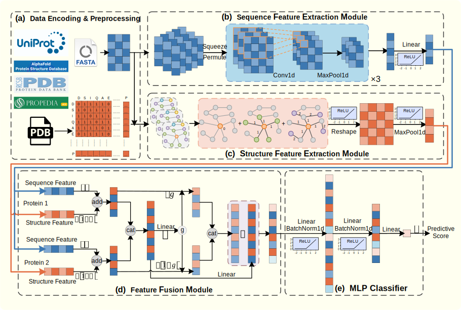

# TPepPro

**GARPepPI: Graph Attention Residual Peptide-Protein Interaction Predictor**

A dual-branch multimodal collaborative learning framework for PepPI prediction, combining ProtT5 sequence embeddings, residue contact maps, TAGCN graph convolutions, and TextCNN.

---

<p align="center">
  
  <br>
  <em>Figure 1. Overall architecture of GARPepPI.</em>
</p>

---

## Installation

### Requirements

| Dependency | Version |
|---|---|
| Python | 3.7+ |
| PyTorch | ≥ 1.5.1 |
| DGL | ≥ 0.6.1 |
| CUDA | 10.1+ |
| scikit-learn | latest |

### Install Commands

```bash
# PyTorch (CUDA 10.1)
conda install pytorch==1.5.1 torchvision==0.6.1 cudatoolkit=10.1 -c pytorch

# DGL for CUDA 10.1
pip install dgl_cu101 -f https://www.dgl.ai/pages/start.html

# Other dependencies
pip install numpy pandas scipy openpyxl xlwt selfies scikit-learn transformers
```

---

## Data Preparation

### Dataset Format

Each dataset should contain two files:

| File | Format | Example |
|---|---|---|
| `{name}.dictionary.tsv` | `ID\tsequence` | `1a1m_A\tMKTVRQERLK...` |
| `{name}.actions.{pos}-{neg}.tsv` | `ID1\tID2\tlabel` | `1a1m_A\t1a1m_C\t1` |

### Step 1 — Generate ProtT5 Embeddings

Edit the input FASTA path in `2_preprocessing/generate_embeddings.py`, then run:

```bash
python 2_preprocessing/generate_embeddings.py
```

- Output: `embeddings/{name}_embeddings.npz` (shape `L × 1024` per entry)

### Step 2 — Generate Contact Maps

Edit the PDB file paths in `2_preprocessing/generate_contact_map.py`, then run:

```bash
python 2_preprocessing/generate_contact_map.py
```

- Output: `contact_map/{name}_contact_map/*.npz` (shape `L × L` per entry)

---

## Training

### 1. Configure Paths

Edit `3_model/args.py` with your actual paths:

```python
# === Output ===
rst_file        = '/path/to/results/result.tsv'
pkl_path        = '/path/to/model_pkl/model_1.0'
test_5fold_path = '/path/to/results/train_5fold/'

# === Data ===
actions_file = '/path/to/{name}.actions.{N}-{N}.tsv'
cmaproot     = '/path/to/contact_map/{name}_contact_map/'
embed_data   = np.load("/path/to/{name}_embeddings.npz", allow_pickle=True)
```

### 2. Run 5-Fold Cross-Validation

```bash
cd 3_model
python main.py
```

Each fold's best model (highest validation accuracy) is saved to `model_pkl/`. Per-fold test predictions are exported as `.xls` files.

---

## Model Architecture

**GARPepPI** (Graph Attention Residual Peptide-Protein Interaction Predictor) employs a dual-branch multimodal collaborative learning architecture. Peptide and protein sequences are processed by identical sequence-structure dual-branch networks with shared weights.

### Sequence Modality

Per-residue embeddings from **ProtT5** are fed into a **TextCNN** (3-layer 1D convolutional network) to produce fixed-dimensional representations.

- ProtT5 embedding model: [Rostlab/prot_t5_xl_half_uniref50-enc](https://huggingface.co/Rostlab/prot_t5_xl_half_uniref50-enc)

### Structure Modality

Residue contact maps derived from PDB files are encoded by a **Topology Adaptive Graph Convolutional Network (TAGCN)** to capture spatial topology via adjacency matrices.

### Fusion Mechanism

The two modalities are integrated through a **residual gated progressive fusion** mechanism:

1. **Intra-molecular fusion**: Sequence and structure features are first merged via static weighted fusion with learnable parameters
2. **Inter-molecular fusion**: Peptide and protein representations are adaptively fused by a dynamic gating unit with residual connections
3. **Prediction**: A multilayer perceptron outputs the final interaction probability

---

## Input & Output

### Input Format

| Field | Description |
|---|---|
| receptor | Protein ID (must exist in embeddings and contact map) |
| peptide | Peptide ID |
| label | `1` = interacting, `0` = non-interacting |

### Output Format

| Field | Description |
|---|---|
| index | Sample index |
| receptor | Protein ID |
| peptide | Peptide ID |
| label | Ground truth |
| predict_score | Interaction probability (0–1) |
| predict_label | Prediction (`1` if score ≥ 0.5) |

---

